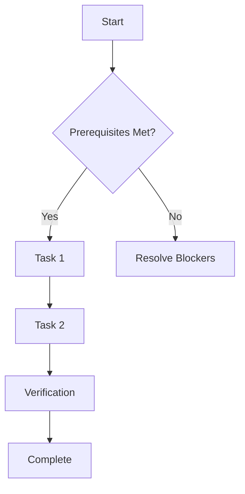

# Epic: [Feature Name]

> [!IMPORTANT]
> **Goal**: [Briefly describe the high-level objective]
> **Value**: [Explain why this is being built - The Why Mandate]

## 🗺 Implementation Flow

## 📋 Task List
- [ ] Task 1: [Short Title] (#IssueID)
- [ ] Task 2: [Short Title] (#IssueID)

---

# Task (Child Issue): [Task Name]

> [!NOTE]
> **Part of Epic**: #[ParentID]
> **Complexity**: < 100 lines of logic

## 🛠 Technical Prerequisites
- [ ] List required interfaces or utils
- [ ] Environment variables needed

## ✅ Success Criteria
1. [Criterion 1]
2. [Criterion 2]

## 🚀 Execution Strategy
1. Create branch `feat/xxx-#[ID]`
2. Implement logic in `src/features/[feature]/`
3. Run `npm run lint` and verify build
