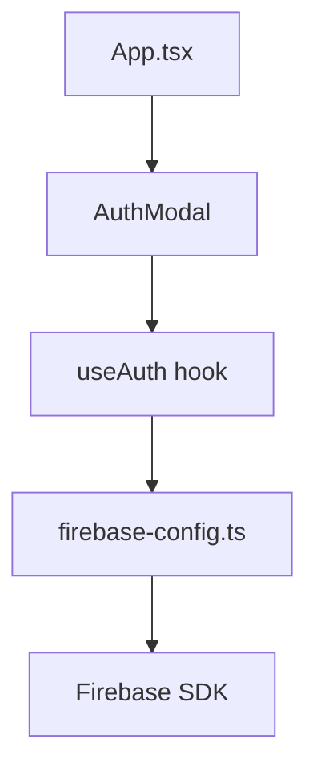

# Feature Trace: Auth 🔐

> [!NOTE]
> **Goal**: Provide secure user authentication and session management using Firebase Auth.
> **Status**: Production Ready
> **Owner**: @chicanoandres702

## 🏛 Architecture Context
- **Pattern**: Provider/Hook pattern for global auth state.
- **Relevant ADR**: [ADR-001: Firebase Consolidation](file:///c:/Users/Andrew/OneDrive/Documents/Coding/AntiGravity/Swagbucks/SentientAIBrowser/docs/architecture/ADR-001-firebase-consolidation.md)
- **Parent Epic**: [#12] Firebase Production Integration

## 🧱 Key Interfaces
- `AuthContextType`: Defines the shape of the global auth state.
- `useAuth()`: Hook to access the current user and login/logout methods.

## 🔗 Dependency Graph

## 📋 Success Metrics
- [x] Zero-trust secret management (Service Account reconstruction)
- [x] Persistent session across reloads
- [x] Multi-platform compatibility (Web/Android)

---
*Generated via AI Constitution Section 9 [Deep Traceability]*
